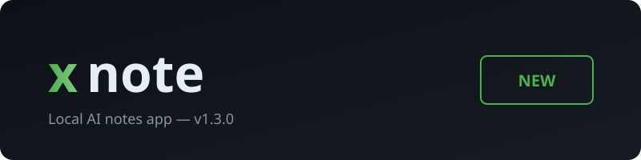

<p align="center">
  
</p>

<h3 align="center">Local AI notes app — fast, private, offline</h3>

<p align="center">
  
  
  
  
</p>

---

## What's new in v1.3.0

### Themes

4 hand-picked themes — each with its own accent color:

| Theme | Style | Accent |
|-------|-------|--------|
| **Dark** | Grayscale dark | `#888888` |
| **Forest** | Green dark | `#4caf50` |
| **Ivory** | Warm light | `#c4956a` |
| **Sky** | Blue light | `#2196f3` |

Open **Settings** (gear icon) to switch themes instantly.

### AI Model

Upgraded to **IBM Granite 4.0 Hybrid Mamba** (350M parameters) — faster inference, lower memory, better quality than the previous Qwen 0.5B model. Runs fully offline via bundled llama.cpp.

### Custom Context Menu

Right-click any note in the sidebar:

- **Delete** — remove the note (with custom themed confirm dialog)
- **AI Features** submenu:
  - **Spell Check** — toggle AI spell checking
  - **Auto Format** — toggle AI auto formatting

### Settings Modal

Full-screen modal with:
- Theme card selector with color swatches
- AI Features toggle
- Version display
- Custom confirm dialog (matches theme, replaces native OS dialog)

### Font

Switched to **Elms Sans** — bundled locally, loads instantly, no internet required.

### UI

- Custom frameless titlebar with traffic light buttons
- Lucide SVG icons throughout
- Bold UI text for better readability
- All colors driven by CSS custom properties per theme

---

## Quick Start

```bash
npm install
npm run dev
```

## How it works

- Electron 28 app, custom frameless window
- Notes saved as JSON in your appData folder
- AI runs locally via bundled llama.cpp server on `127.0.0.1:8080`
- Granite 4.0 Hybrid Mamba 350M model bundled (no download needed)
- All AI features can be toggled off in Settings

## Project Structure

```
xnote/
  main.js            # Electron main process, IPC handlers, AI server
  preload.js         # Context bridge for renderer
  renderer/
    index.html       # App UI
    app.js           # Renderer logic
    styles.css       # Theme variables + component styles
    fonts/           # Elms Sans TTF files
    assets/          # SVG icons
  ai/
    llama-server.exe # Bundled llama.cpp server
    model.gguf       # Granite 4.0 Hybrid Mamba 350M (Q4_K_M)
```

## License

MIT
