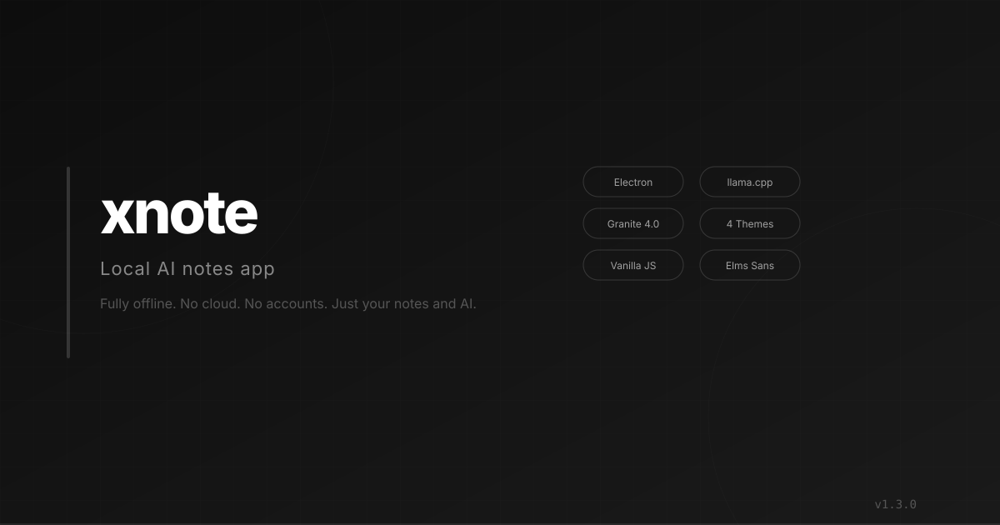

<p align="center">
  
</p>

<p align="center">
  
  
  
  
  
</p>

<p align="center">
  <strong>A minimal, private notes app with built-in AI that runs entirely on your machine.</strong>
</p>

<p align="center">
  No cloud. No accounts. No tracking. Just your notes and AI.
</p>

---

## Table of Contents

- [About](#about)
- [Features](#features)
- [Installation](#installation)
- [How to Use](#how-to-use)
- [AI Model](#ai-model)
- [Themes](#themes)
- [Tech Stack](#tech-stack)
- [Disclaimer](#disclaimer)
- [License](#license)

---

## About

**xnote** is a local-first AI notes app built with Electron. Notes are stored as JSON on your machine. AI runs via a bundled llama.cpp server on localhost — no internet required.

Unlike cloud-based note apps, xnote keeps everything on your device. Your notes never leave your machine. The AI model is bundled with the app, so it works fully offline after install.

---

## Features

### Notes
- Create, edit, delete notes
- Auto-save on every keystroke
- JSON storage in your appData folder
- Sidebar with live preview
- Right-click context menu

### AI
- Spell check via local LLM
- Auto format suggestions
- Auto title generation
- Granite 4.0 Hybrid Mamba 350M model
- Bundled — no download needed

### Themes
- Dark — grayscale (default)
- Forest — green accent
- Ivory — warm light
- Sky — blue light
- Instant switch from settings

### UI
- Custom frameless titlebar with traffic lights
- Lucide SVG icons
- Elms Sans font (bundled locally)
- Themed confirm dialogs
- Bold UI text for readability
- All colors driven by CSS custom properties

---

## Installation

### Prerequisites

- Windows 10/11, macOS, or Linux
- Node.js 18+ (for development)

### Quick Start

```bash
git clone https://github.com/rizzwixk/xnote.git
cd xnote
npm install
npm run dev
```

The app opens in development mode. The AI server starts automatically on first launch.

### Note

The model file (`ai/model.gguf`) is gitignored. It must be placed manually in the `ai/` directory. See [AI Model](#ai-model) for details.

---

## How to Use

1. Launch the app with `npm run dev`
2. Click **+ New Note** in the sidebar to create a note
3. Type your note — it auto-saves as you type
4. Open **Settings** (gear icon) to switch themes or toggle AI
5. Right-click a note in the sidebar for delete and AI options

---

## AI Model

xnote uses **IBM Granite 4.0 Hybrid Mamba 350M** (Q4_K_M, 212MB).

| Spec | Value |
|------|-------|
| Parameters | 350M |
| Quantization | Q4_K_M |
| Size | 212MB |
| Architecture | Hybrid Mamba-attention |
| License | Apache 2.0 |

The model runs via bundled `llama-server.exe` on `127.0.0.1:8080`.

---

## Themes

4 hand-picked themes, each with its own accent color:

| Theme | Style | Accent |
|-------|-------|--------|
| Dark | Grayscale | `#888888` |
| Forest | Green dark | `#4caf50` |
| Ivory | Warm light | `#c4956a` |
| Sky | Blue light | `#2196f3` |

Open **Settings** to switch themes instantly.

---

## Tech Stack

| Layer | Technology |
|-------|------------|
| Desktop | Electron 28 |
| Frontend | Vanilla JS, HTML, CSS |
| AI | llama.cpp b10099 |
| Model | Granite 4.0 Hybrid Mamba 350M |
| Font | Elms Sans (bundled) |
| Icons | Lucide SVG |

---

## Disclaimer

This app is fully vibe coded. If that bothers you, it's probably not for you.

No tests. No CI. No type safety. Just vibes and a text editor.

---

## License

[MIT](LICENSE)

---

<p align="center">
  <sub>Built with vibes and a text editor</sub>
</p>
